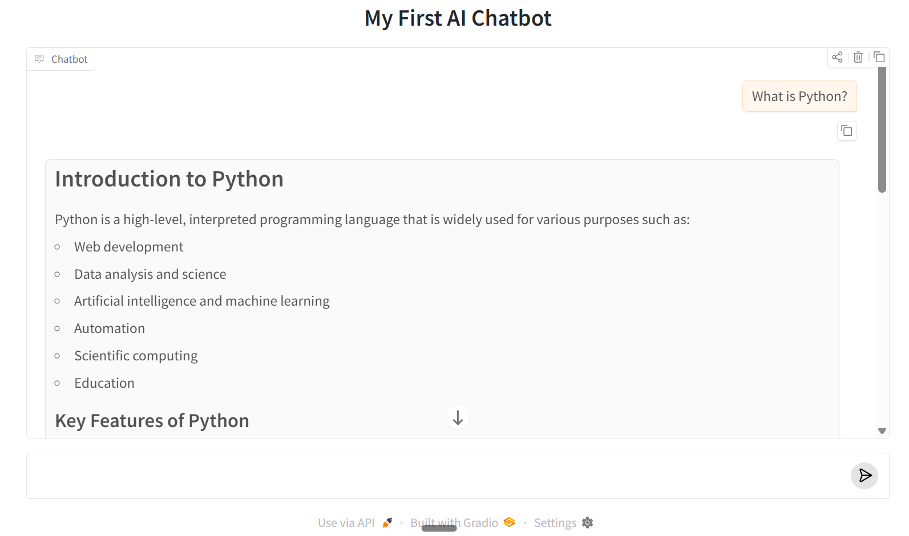
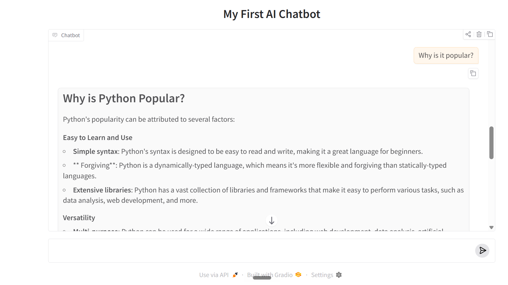

# 🚀 GenAI SoC 2026

My learning repository for the **Generative AI Summer of Code 2026**.


A simple GenAI chatbot built using Python and Groq.

## Features

- Uses Groq API
- Reads API key from `.env`
- Interactive prompt input
- System prompt support
- Experiments with:
  - Zero-shot prompting
  - One-shot prompting
  - Few-shot prompting
  - Role prompting
  - Constraints

## Tech Stack

- Python
- Groq SDK
- python-dotenv

## Run

```bash
pip install -r requirements.txt
python app.py


# 📚 Week 1: Foundations of Generative AI

## Topics Covered

* API Keys and Environment Variables (`.env`)
* Groq API Integration
* Prompt Engineering Basics
* System, User, and Assistant Roles
* Temperature and Model Behavior
* Context Windows and Conversation History
* Streaming Responses
* Building Chatbots with Gradio
* Git and GitHub Workflow

---

# 🛠️ Projects Built

## 1. Basic LLM Call (`app.py`)

A simple Python script that sends a prompt to the Groq API and prints the model's response.

### Features

* Connects to Groq API
* Uses environment variables for security
* Generates AI responses from prompts

---

## 2. Conversation Chatbot (`conversation_chat.py`)

A terminal-based chatbot that maintains conversation history and supports multi-turn interactions.

### Features

* Conversation memory
* System prompts
* Multi-turn conversations
* Context-aware responses

---

## 3. Streaming Demo (`streaming_demo.py`)

Demonstrates real-time token streaming from the language model.

### Features

* Streaming responses
* Token-by-token output
* Lower perceived latency
* Better user experience

---

## 4. Gradio Chatbot (`gradio_chatbot.py`)

A browser-based AI chatbot built using Gradio and Groq.

### Features

* Interactive web interface
* Conversation memory
* Multi-turn interactions
* Custom system prompts
* Groq-powered responses

---

# 💻 Tech Stack

* Python
* Groq API
* Llama 3.3 70B
* Gradio
* python-dotenv
* Git
* GitHub

---

# 🎯 Key Learnings

* Language models do not have memory by default.
* Conversation history must be managed and sent with each request.
* System prompts strongly influence model behavior.
* Streaming improves user experience.
* Gradio enables rapid AI application development.
* Prompt engineering can significantly change model output quality.

---

# 🚀 Running the Project

## 1. Clone the Repository

```bash
git clone <your-repository-url>
```

## 2. Create a Virtual Environment

```bash
python -m venv venv
```

## 3. Activate the Virtual Environment

### Windows

```bash
venv\Scripts\activate
```

### Linux / macOS

```bash
source venv/bin/activate
```

## 4. Install Dependencies

```bash
pip install -r requirements.txt
```

## 5. Create a `.env` File

```env
GROQ_API_KEY=your_api_key_here
```

## 6. Run the Projects

```bash
python app.py
python conversation_chat.py
python streaming_demo.py
python gradio_chatbot.py
```

---

# 📸 Demo





# 🌱 Progress
In week 2, Learnt about RAG and how LLMs use vector representation and how to reduce hallucinations. Created my Docbuddy AI agengt which allows pdf files to use and answer Questions.

✅ Week 1 Completed

✅ Week 2: Retrieval-Augmented Generation (RAG)

